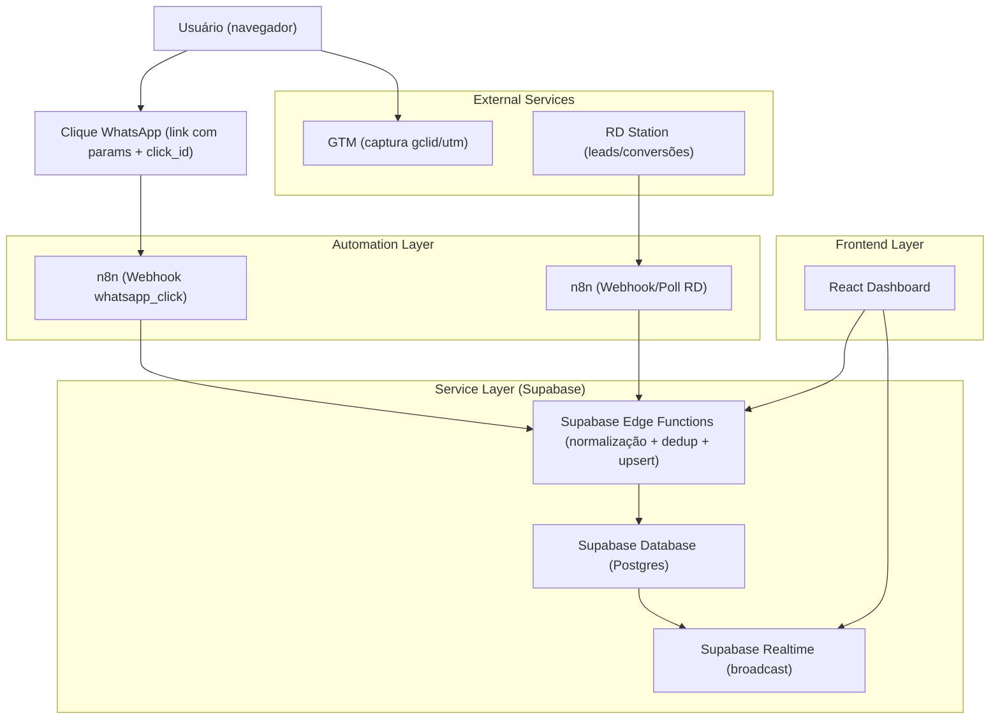
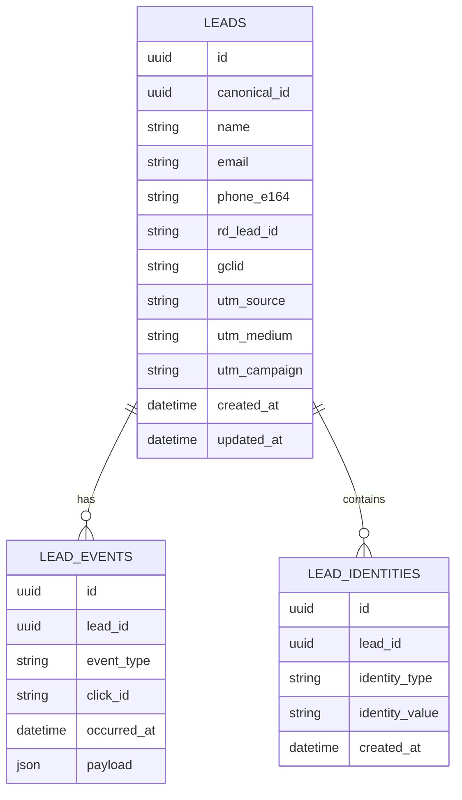

## 1.Architecture design


## 2.Technology Description
- Frontend: React@18 + vite + tailwindcss@3
- Backend: Supabase (Edge Functions + Auth opcional + Realtime)
- Automação/Integrações: n8n (webhooks, transformações, chamadas RD Station)

## 3.Route definitions
| Route | Purpose |
|-------|---------|
| / | Painel em tempo real (feed + métricas + filtros) |
| /lead/:id | Detalhe do lead (identidade consolidada + timeline + dedup) |
| /integracoes | Integrações e regras (gclid→WhatsApp, RD/n8n, dedup) |

## 4.API definitions
### 4.1 Core API (Supabase Edge Functions)
**Receber clique de WhatsApp (via n8n)**
```
POST /functions/v1/track_whatsapp_click
```
Request:
| Param Name | Param Type | isRequired | Description |
|-----------|------------|------------|-------------|
| click_id | string | true | ID único do clique |
| phone | string | false | Telefone digitado/identificado (se existir) |
| gclid | string | false | Google Click ID |
| utm | object | false | utm_source/utm_medium/utm_campaign/utm_content/utm_term |
| landing_url | string | false | URL de origem |
| occurred_at | string | true | ISO datetime do evento |

**Receber evento do RD Station (via n8n)**
```
POST /functions/v1/track_rd_event
```
Request:
| Param Name | Param Type | isRequired | Description |
|-----------|------------|------------|-------------|
| rd_lead_id | string | true | Identificador do RD |
| event_type | string | true | Tipo (ex.: conversion) |
| email | string | false | Email do lead |
| phone | string | false | Telefone do lead |
| payload | object | true | Payload essencial para auditoria |
| occurred_at | string | true | ISO datetime do evento |

**Tipos compartilhados (TS, referência)**
```ts
type Lead = {
  id: string
  canonical_id: string | null
  name: string | null
  email: string | null
  phone_e164: string | null
  rd_lead_id: string | null
  gclid: string | null
  utm_source: string | null
  utm_medium: string | null
  utm_campaign: string | null
  created_at: string
  updated_at: string
}

type LeadEvent = {
  id: string
  lead_id: string
  event_type: 'whatsapp_click' | 'rd_event' | 'gtm_capture'
  click_id: string | null
  occurred_at: string
  payload: Record<string, any>
}
```

## 6.Data model
### 6.1 Data model definition


### 6.2 Data Definition Language
Leads (leads)
```
CREATE TABLE leads (
  id UUID PRIMARY KEY DEFAULT gen_random_uuid(),
  canonical_id UUID NULL,
  name TEXT NULL,
  email TEXT NULL,
  phone_e164 TEXT NULL,
  rd_lead_id TEXT NULL,
  gclid TEXT NULL,
  utm_source TEXT NULL,
  utm_medium TEXT NULL,
  utm_campaign TEXT NULL,
  created_at TIMESTAMPTZ NOT NULL DEFAULT now(),
  updated_at TIMESTAMPTZ NOT NULL DEFAULT now()
);
CREATE INDEX idx_leads_phone_e164 ON leads(phone_e164);
CREATE INDEX idx_leads_email ON leads(email);
CREATE INDEX idx_leads_rd_lead_id ON leads(rd_lead_id);
CREATE INDEX idx_leads_gclid ON leads(gclid);

CREATE TABLE lead_events (
  id UUID PRIMARY KEY DEFAULT gen_random_uuid(),
  lead_id UUID NOT NULL,
  event_type TEXT NOT NULL,
  click_id TEXT NULL,
  occurred_at TIMESTAMPTZ NOT NULL,
  payload JSONB NOT NULL DEFAULT '{}'::jsonb,
  created_at TIMESTAMPTZ NOT NULL DEFAULT now()
);
CREATE INDEX idx_lead_events_lead_id ON lead_events(lead_id);
CREATE INDEX idx_lead_events_occurred_at ON lead_events(occurred_at DESC);

CREATE TABLE lead_identities (
  id UUID PRIMARY KEY DEFAULT gen_random_uuid(),
  lead_id UUID NOT NULL,
  identity_type TEXT NOT NULL,
  identity_value TEXT NOT NULL,
  created_at TIMESTAMPTZ NOT NULL DEFAULT now()
);
CREATE INDEX idx_lead_identities_type_value ON lead_identities(identity_type, identity_value);

-- permissões (ajuste com RLS conforme necessidade)
GRANT SELECT ON leads, lead_events, lead_identities TO anon;
GRANT ALL PRIVILEGES ON leads, lead_events, lead_identities TO authenticated;
```
